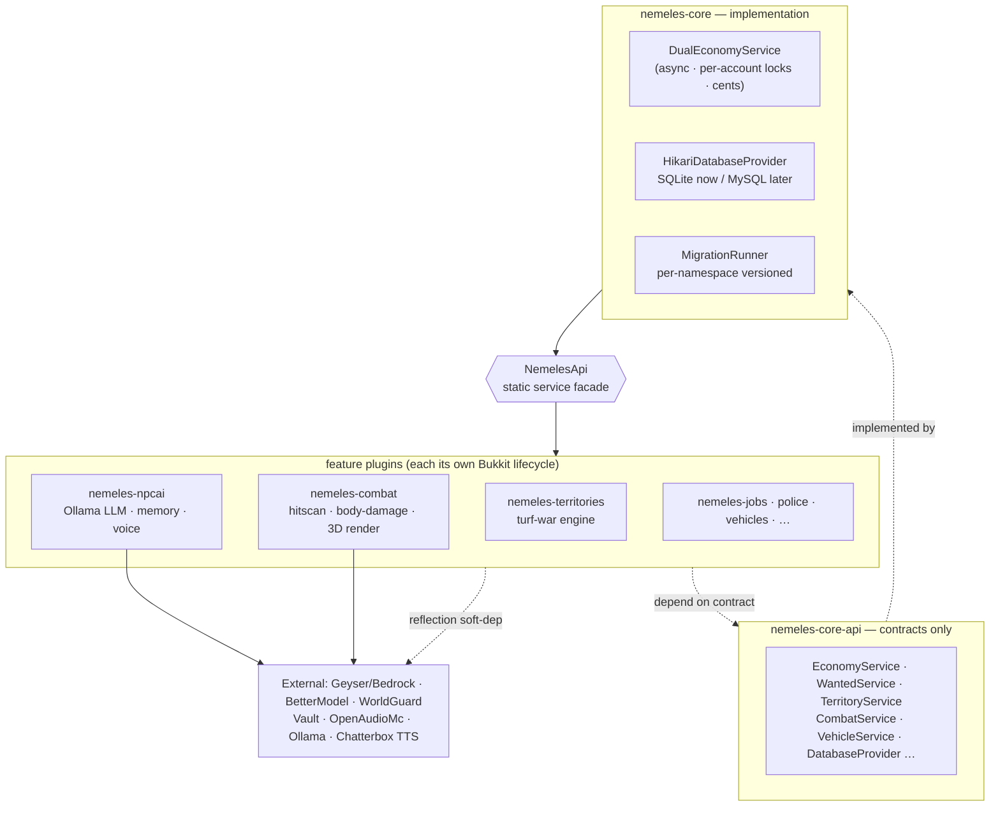

# NemelesRP — A 30-module GTA-style Minecraft RP server, architected & shipped solo in ~20 days

[](https://github.com/NemelesUrek/nemeles-rp-showcase/actions/workflows/maven.yml)

> **Source-available portfolio.** Built AI-leveraged: I architect, integrate and direct the
> code — the demonstrable skill is system design, cross-engine integration and delivery
> speed, not hand-typing every line.

A full roleplay economy/crime server for Paper Minecraft with **true Java ⇄ Bedrock
crossplay**, a **concurrency-correct dual-currency bank**, **NPCs driven by a local LLM
(Ollama) with memory and cloned-voice TTS**, and a **3D weapon rendering pipeline** that
achieves real parity across two game engines.

> **What's in this repo.** This is a **curated, buildable slice** of a much larger private
> server (30 modules / 461 Java files / ~20.6k LOC). The `nemeles-core-api`, `nemeles-core`
> and `nemeles-jobs` modules **build and pass tests** here (green CI above). The
> [`highlights/`](highlights/) folder contains **representative source** from the most
> interesting modules (combat/render code, local-LLM NPCs, turf-war, crossplay tooling) for
> reading — see [`highlights/HIGHLIGHTS.md`](highlights/HIGHLIGHTS.md). The full server stays private.

---

## ⏱️ The hook: ~20 days, one builder

I designed and shipped this **30-module Maven system — 461 Java files, ~20.6k LOC — in
roughly 20 days**, working solo and AI-leveraged. The interesting part isn't any single
algorithm. It's that the whole thing is *decoupled cleanly*: a ports-and-adapters core,
28 feature plugins that depend only on contracts, graceful degradation when peers are
absent, correct async/threading discipline, and money handled as integer cents with
transactional rollback.

**What this demonstrates to a hiring team:** I can take a complex, fuzzy domain, decompose
it into clean modules, integrate undocumented third-party APIs (Geyser/Bedrock, BetterModel,
WorldGuard, Vault, Ollama, OpenAudioMc, HikariCP), and ship it fast without the architecture
collapsing.

> Honest framing: this is AI-assisted development. I direct the AI, make the architectural
> calls, debug across Java + Python + web, and own the result. I'm not claiming to have
> hand-written every line — I'm claiming I can *architect and deliver* this, fast.

---

## 🏛️ Architecture

Ports-and-adapters. `nemeles-core-api` holds **only** interfaces, events and records.
`nemeles-core` implements them and registers them on a single static facade, `NemelesApi`.
The feature modules consume **the contract, never the implementation** — and degrade
gracefully (`soft-depend`) when a peer plugin is missing.



---

## 🧰 Tech stack

| Layer | Tech |
|---|---|
| Language / platform | **Java 17**, Paper/Spigot (Bukkit API) |
| Build | **Maven** multi-module (parent POM, `dependencyManagement`, `maven-shade` + relocation) |
| Persistence | **HikariCP**, **SQLite** (WAL/single-writer) → **MySQL**-ready, namespaced migrations |
| Concurrency | `CompletableFuture` on a dedicated DB executor, `ReentrantLock` per account, lock-ordering by UUID |
| Crossplay | **Geyser / Floodgate** (Bedrock), **BetterModel / GeyserModelEngine** for 3D parity |
| AI / LLM | **Ollama** (qwen) via `java.net.http` async client; **Chatterbox** cloned-voice TTS (Python) |
| Tests / CI | **JUnit 5**, **GitHub Actions** |

---

## ✨ Highlights (see [`highlights/`](highlights/) for the source)

- **`DualEconomyService`** — concurrency-correct dual-currency bank: async on a dedicated DB
  executor, per-account `ReentrantLock`s ordered by UUID (deadlock-free), money as `long`
  cents with transactional rollback, and a forensic "marked money" laundering/ATM system.
  *(In this repo, fully buildable + unit-tested.)*
- **`GunModelService`** — 3D weapons with real Java ⇄ Bedrock parity: wraps the BetterModel
  API by pure reflection (soft-dep), hides the Java disguise from Bedrock players via Floodgate.
- **Combat & medical** — double raytrace hitscan, 15-part anatomical damage, a
  Project-Zomboid-style medical model (bleeding, fractures, infections, healing minigames).
- **`npcai`** — NPCs driven by a local LLM (Ollama) with persistent memory, per-player affinity,
  world-context prompts, a CJK language-drift guard, and a real-time cloned-voice loop.
- **Crossplay asset conversion** — adapting third-party weapon assets (**AG2 / guns++**, *credited*)
  to a Java-compatible format and **Java ⇄ Bedrock parity**, incl. a **from-scratch software 3D
  rasterizer** (pure Pillow) that renders Bedrock geometries to 2D inventory icons.
- **Crossplay packaging tooling** (PowerShell/Python) — including a script that reskins the
  **vanilla** Minecraft boat per wood-variant to render distinct 3D vehicles on Bedrock with
  zero Java changes.

---

## 📱 NemelesPhone — proprietary product (not in this repo)

A full in-game **smartphone plugin** I built — multiple apps, Java ⇄ Bedrock crossplay UIs, and
voice calls via OpenAudioMc. It's kept **private** as a commercial product and will be
**available for licensing to Minecraft servers**. Demo or licensing inquiries: **emuiser1@gmail.com**.

---

## 📱 Also built (private): NemelesPhone

A full in-game **smartphone plugin** for the server — apps, contacts, UI, crossplay. Kept
**private** as a product: a **commercial release for server owners is planned**. Mentioned here
for context — its code is not part of this showcase.

---

## ▶️ Build & test

**Prerequisites:** JDK 21, Maven 3.9+.

```bash
git clone https://github.com/NemelesUrek/nemeles-rp-showcase.git
cd nemeles-rp-showcase
mvn -q clean test    # builds core-api -> core -> jobs and runs the JUnit tests
```

**Reading order for reviewers:**
1. `nemeles-core-api/.../NemelesApi.java` — the contract facade (architecture in one file).
2. `nemeles-core/.../economy/DualEconomyService.java` — concurrency + money handling (with tests).
3. `highlights/nemeles-combat/.../render/GunModelService.java` — reflection soft-dep + crossplay.
4. `highlights/nemeles-npcai/.../ConversationManager.java` — the LLM prompt-assembly pattern.

> Code comments and identifiers are in Spanish (my working language); this README is in English.

---

## 🙏 Credits & attribution

The 3D **weapon** models/textures used by the live server are from **Actual Guns 2 (AG2)** and
**guns++**, by their respective creators — full credit to them. **My contribution is the
engineering:** converting those assets to a **Java-compatible** format and achieving **true
Java ⇄ Bedrock crossplay parity** for them (the rendering code in `highlights/nemeles-combat/` and
the tooling in `highlights/resourcepack-scripts/`). The **asset files themselves are not
redistributed** in this repository. Vehicle tooling reskins **vanilla** Minecraft assets.

---

## ⚖️ License

**Copyright © 2026 Nemeles. All rights reserved.**

Source-available for portfolio and review purposes only. No permission is granted to use,
copy, modify, redistribute or deploy this code, in whole or in part. No open-source license applies.

For licensing or work inquiries: **emuiser1@gmail.com**
